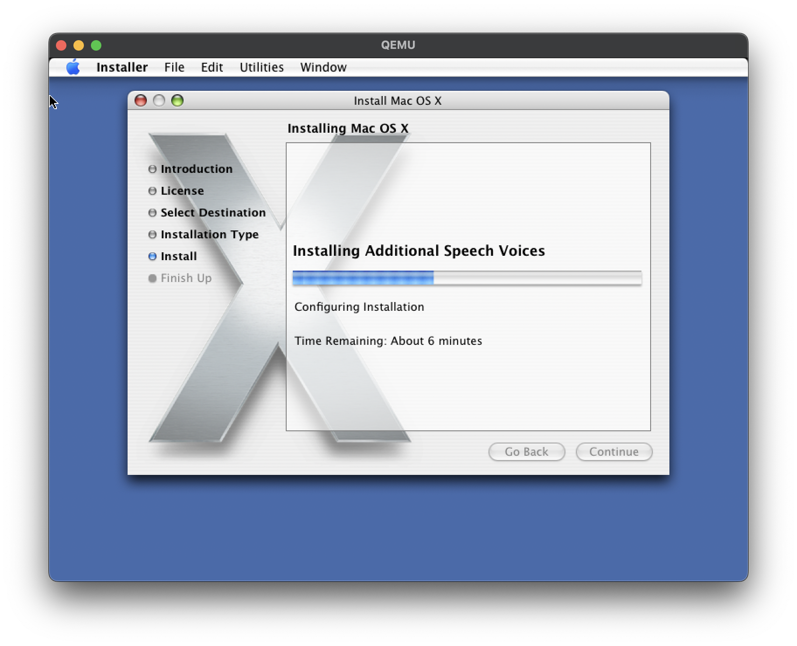

+++
title = "emulating a mac os x 10.4.11 machine - some notes"
+++

*written in: January-Feburary 2025*\
*while i was doing this i was: very sick*

i miss my old powerbook g4 a lot rn (i still have it but it's like 1300km away at my parents' house.) its time for some `qemu-system-ppc` then i guess

lets make a hard disk to write to first. we'll go for 64GiB.
```
qemu-img create -f qcow2 mac-hdd.qcow2 64G
```

we need an installer but unfortunately 10.4.11 wasn't ever shipped as a unified install disk; you need to install a previous version of tiger and then use the combo update to 10.4.11 (`MacOSXUpdCombo10.4.11PPC.dmg`; you can still [get this from apple](https://support.apple.com/en-us/106535)). to start with, i'll use a the 10.4 retail DVD (8A428).

now its time to invoke qemu to run the installer:

```
qemu-system-ppc \
```
emulate a mac99 system topology; use pmu power management, providing USB mouse&kbd
```
  -M mac99,via=pmu \
```
use the openbios implementation bundled with qemu. ngl i think this is the default now and has no effect
```
  -L pc-bios \
```
boot from cdrom for install
```
  -boot d \
```
mount our install iso and hard disk
```
  -drive file="Mac OS X 10.4 Tiger Retail DVD.iso",format=raw,media=cdrom \
  -drive file=mac-hdd.qcow2 ,format=qcow2,media=disk
```

once the installer splash is up, open a terminal with **Utilities > Terminal**. we need to set back the clock since certs died on 24 oct 2019:
```
date 1001000019
```
and then turn our blank disk into something we can install on:
```
diskutil eraseDisk "Journaled HFS+" qemac disk0
```

dont forget to customize install and add X11 if u need it :) you can also safely save ~1.6GiB if you don't need printer drivers, and another 1.1GiB if you ditch language translations (or just pick a specific one, each is only ~100MiB!)
disk space notwithstanding (it's 202x!) turning off components is quite useful in qemu - the less you need to copy from the emulated dvd to the hard drive the better, since they're both relatively slow.



# if you want sound to work
you're going to need the [screamer](https://github.com/mcayland/qemu) fork of qemu. it's trivial to build, but remember you can cut build time by only targeting one system:
```
mkdir build; cd build
../configure --target-list="ppc-softmmu"
make -j$(sysctl -n hw.logicalcpu)
```
on macos you will need to pass `-display cocoa` to qemu or it'll autodetect the wrong display backend for some obscure reason i have no interest in discovering
