+++
title = "citibike citibike citibike"
+++

> *traded in the blue for the white bike, everything we do is the zeitgeist*

*written in: March 2025*\
*writing begun while I was: at a cafe after hanging out with my F\*GGOT FRIENDS*

# can we just look at citibikenyc.com?
no!!! because they're ANNOYING >:( the [web ride history interface](https://account.citibikenyc.com/ride-history) looks like:

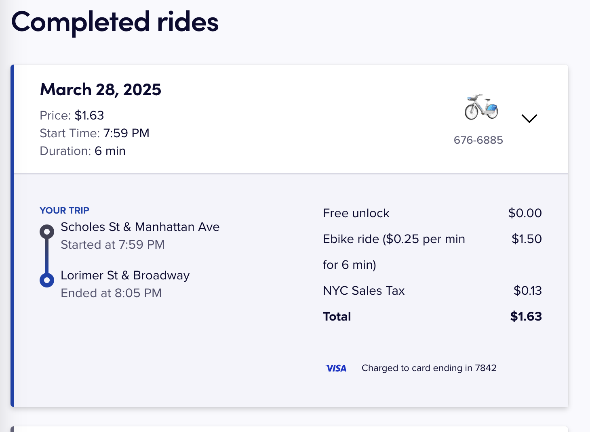

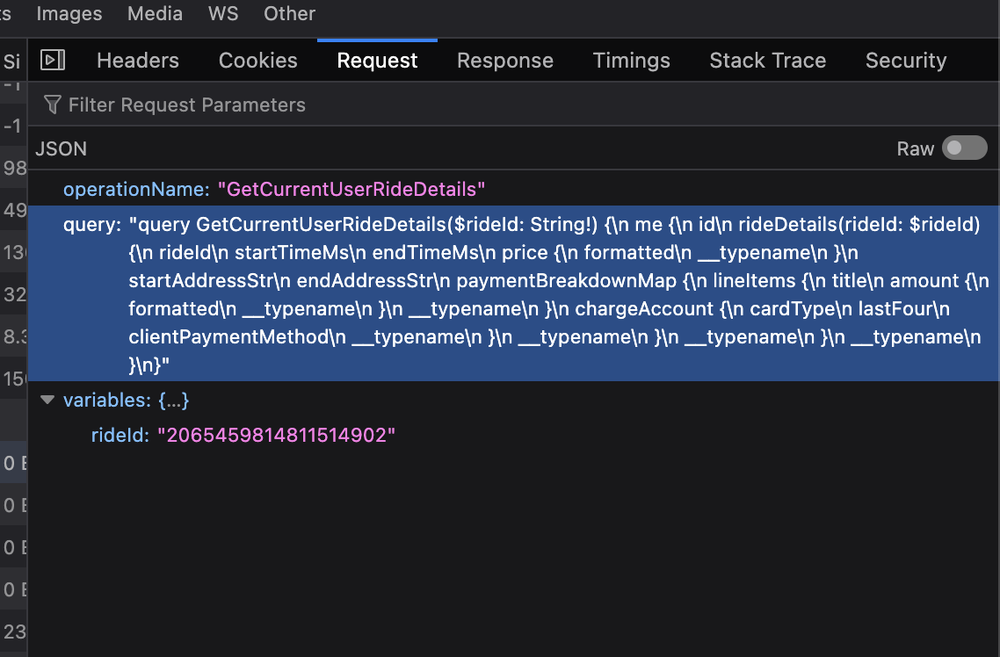

at least we know that https://account.citibikenyc.com/bikesharefe-gql is a graphql endpoint. unfortunately they're using apollo w/ `introspection: false`. maybe there's something we can query in here to get a trajectory but i can't find any references to sth like that by dorking `bikesharefe-gql` and im guessing it might not exist, since trip traces seem to have been moved to Lyft's infrastructure when they ported the app to a somewhat shared codebase (i think this is potentially why the old "export ride history" feature mentioned various places on the internet is gone.)

# lets inspect network traffic (the boring part)
i generated a Pixel 9 AVD with android 15/api 35 and rooted [with magisk](https://gitlab.com/newbit/rootAVD). we need to add certs to the system CA store; back btwn android 4-7 you could just add user root certs which were respected by apps but that's no longer the case. to make things even more annoying: pre android 14 the system CA store was just canonically the contents of `/system/etc/security/cacerts/`; now they have a whole mechanism for APEX for encapsulating the trust roots now so we'll use https://github.com/pwnlogs/cert-fixer to deal w/ that.

first, launch your avd pointed at the proxy:
```
$ANDROID_HOME/emulator/emulator -avd Pixel_9 -no-snapshot-load -http-proxy 127.0.0.1:8080
```
use mitm.it on-device to install the CA cert to the user store. cert-fixer will copy user certs into the system trust store at boot.

copy cert-fixer over (`adb push Cert-Fixer.zip /storage/emulated/0/Download/`, etc). open magisk, let it reboot when the modal noting it "requires additional setup" pops, and install Cert-Fixer.zip:
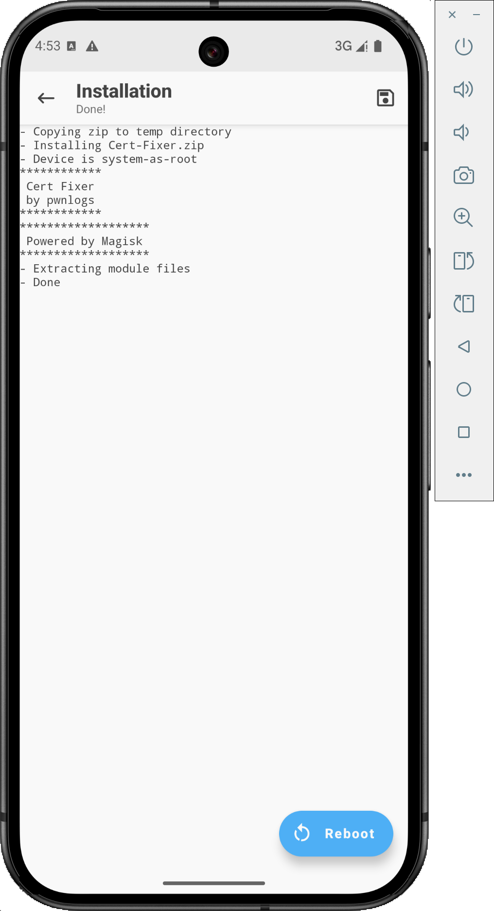

take the reboot, and "mitmproxy" should show up in the 'Trusted credentials' menu now:
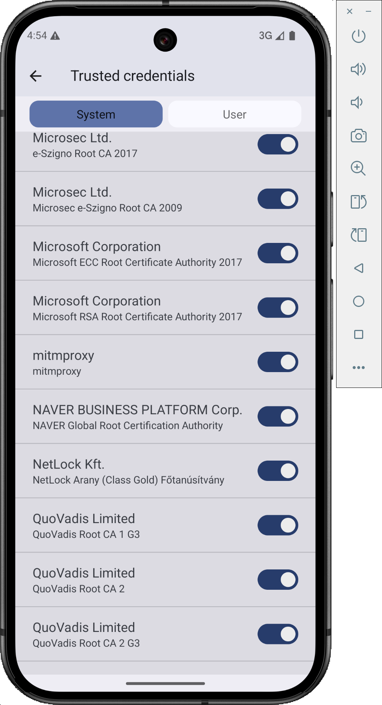
*iq test girl be like: whihc o f these is n ot like other?? u~u*

i'm just going to try installing the raw app since i had the apks laying around already. hopefully they don't pin certs
```
adb install-multiple apks/{base.apk,split_config.arm64_v8a.apk,split_config.xxhdpi.apk}
```

popped the app and immediately saw cleartext requests, yippee... shoutout not pinning certs the dolls LOVE u for this <333
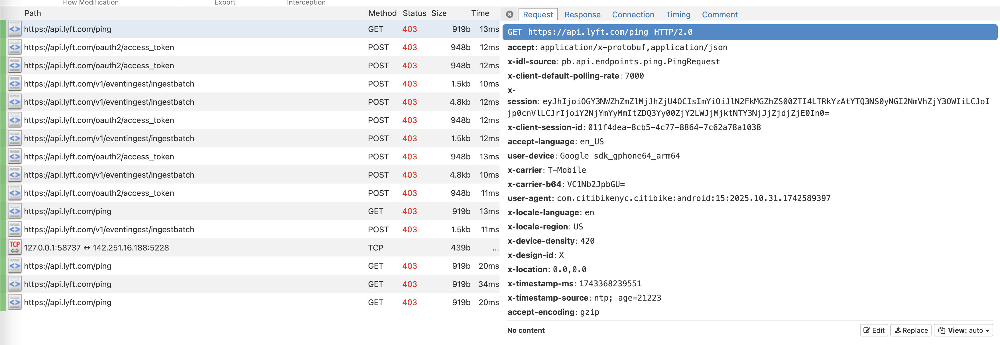
*that's oomfie*


unfortunately things arent looking so good on the.  Response side of things
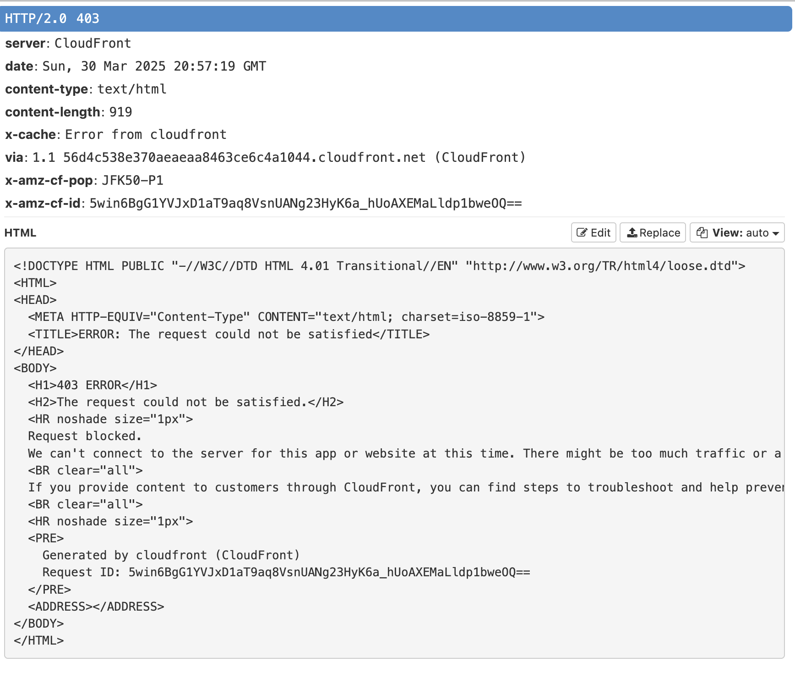
*like a moth drawn to the flame, your wings will burn in anguish*

this is hyperannoying bcs requests to `https://play.googleapis.com/` seem fine. i think cloudfront is identifying a characteristic [ja3 fingerprint](https://engineering.salesforce.com/tls-fingerprinting-with-ja3-and-ja3s-247362855967/) for mitmproxy since it doesn't mirror, eg, the underlying reported cipher suites of the client. for weird reasons openssl doesnt let you customize the cipher suite in tls1.3 but im suspecting the 1.2 default list won't be flagged by cloudfront. so lets launch mitmweb with `--set tls_version_server_max=TLS1_2`. and lets go! this fingerprint isnt blocked:
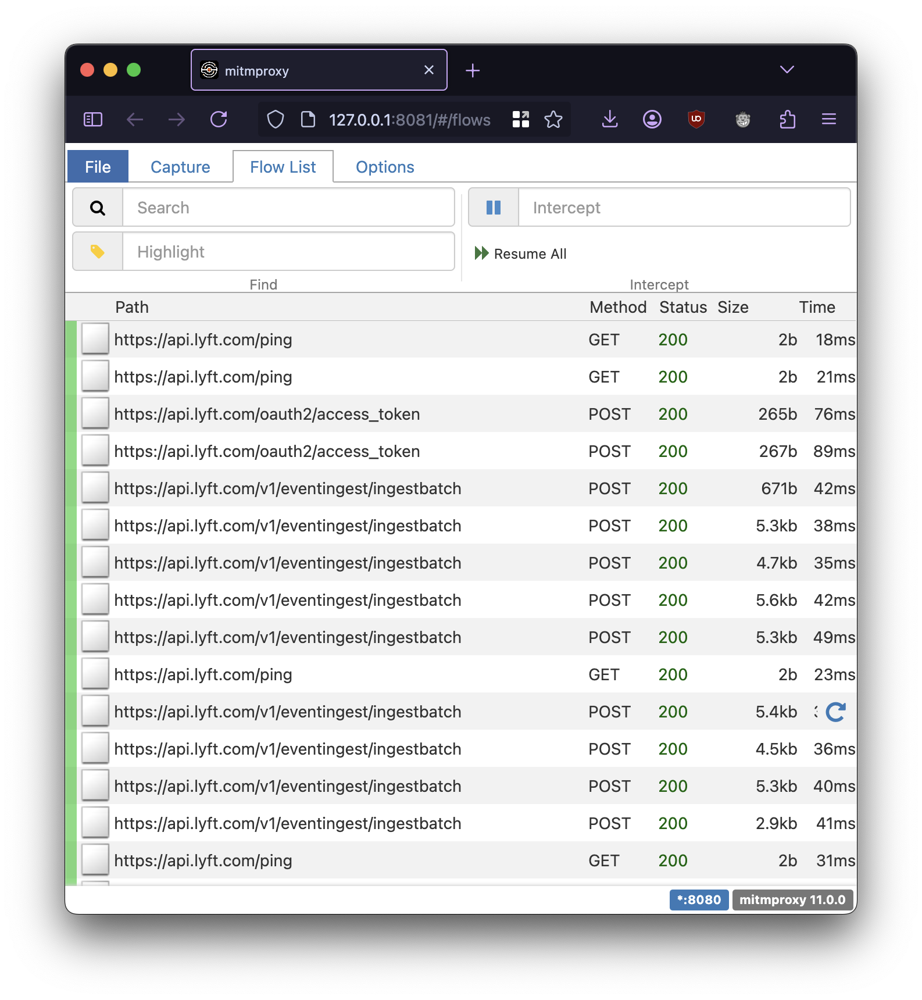
*sometimes, expensive things. are Worse*

# the fun part of mitming an app

and now, by opening this screen
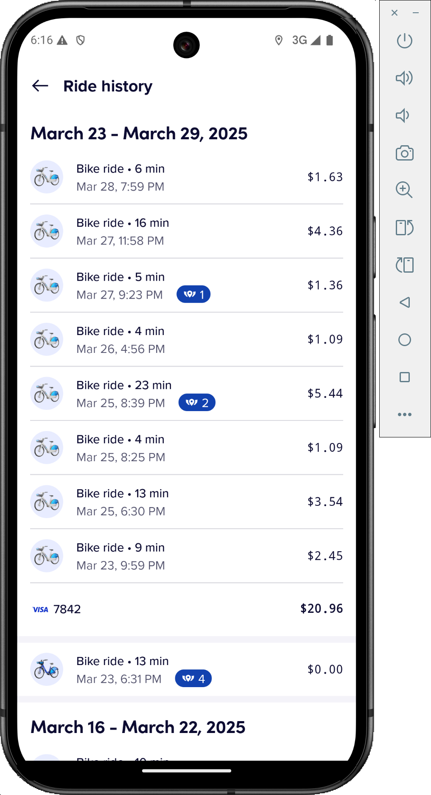

and then clicking on an individual ride:
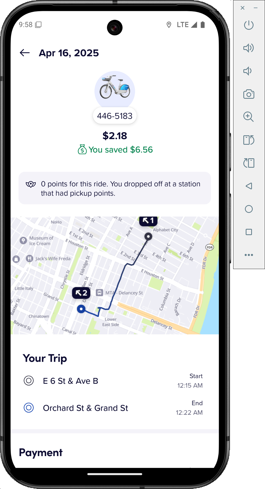
*P.H.O 2*

we discover
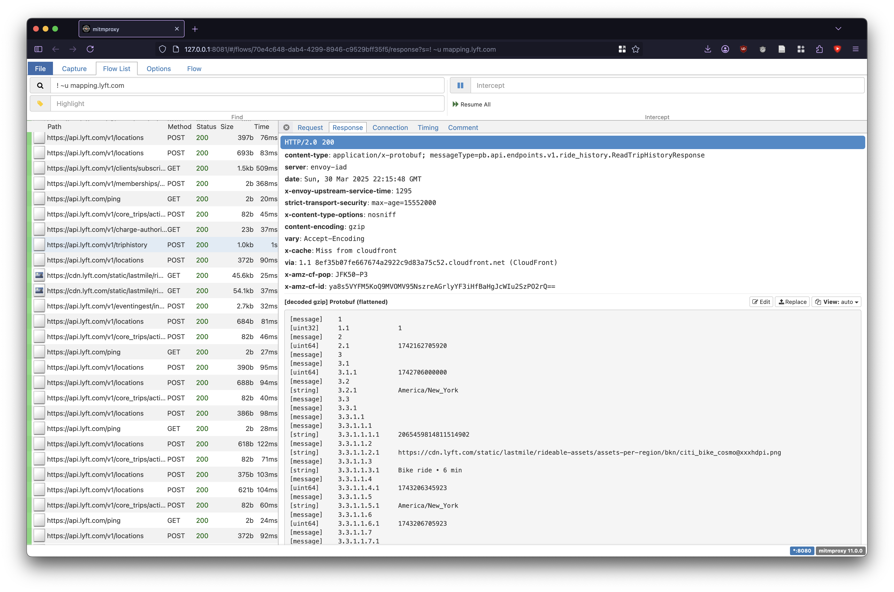

[!tip] we smoking filtered crack, you stupid piece of shit
get rid of tracking junk/dock status updating/etc
```
! (~u mapping.lyft.com
  | ~u api.lyft.com/ping
  | ~u api.lyft.com/v1/locations
  | ~u api.lyft.com/v1/core_trips/activetrips
  | ~u https://api.lyft.com/v1/eventingest/ingestbatch
  | ~u bitdrift.io )
```

clicking on a ride gives us this response:
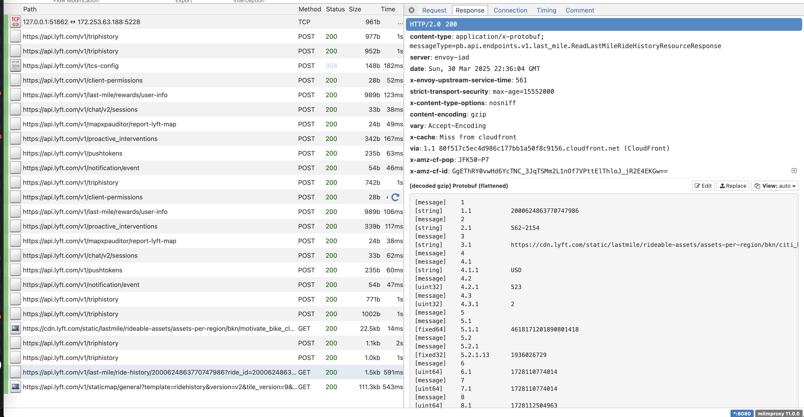
the key requests here (actually, the only ones doing anything functional!) are
- **`https://api.lyft.com/v1/triphistory`**; this pulls a page of ride history results. you pass it some json data w/ the request to do pagination:
```json
{
    "source": 1,
    "start_time": 1745027186606,
    "trip_purpose": 1
}
```
`source` and `trip_purpose` are both enums, and i know they look like
```protobuf
enum TripPurpose {
    UNKNOWN_TRIP_PURPOSE = 0;
    PERSONAL = 1;
    BUSINESS = 2;
}

enum Source {
    SOURCE_UNKNOWN = 0;
    RIDE_HISTORY_LIST = 1;
    HELP_RIDE_SELECTOR = 2;
}
```
these are the *exact* internal names that Lyft uses, and i know this because of a secret trick that will be revealed in due course.
`start_time` is dubiously named, and it basically just means it'll return some arbitrary number of rides *before that time.* then you loop and do it all again. this is just in integer ms since the Unix epoch. it actually returns them in explicit groups; the grouping of rides in the UI screenshot earlier is done server-side.
- **`https://api.lyft.com/v1/last-mile/ride-history/{id}?ride_id={id}`**; this gets an individual ride's information. no raw data for the ride route, but it's embedded in the url to a map image generator
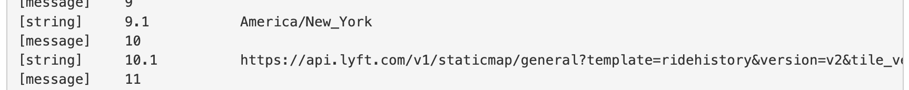

i guessed these were encoded as [google compressed polylines](https://developers.google.com/maps/documentation/utilities/polylinealgorithm), and yeah:

*they ask me what i'm on: i'm like, WiFi*

side note: google compressed polylines are weird. they're fundamentally variable-length integers kind of like [LEB128](https://en.wikipedia.org/wiki/LEB128) or the [Minecraft networking VarInt](https://minecraft.wiki/w/Protocol_data_types#VarInt_and_VarLong) format, except here the groups are 5-bit, continuation is signaled by 0x20, and they're encoded as printable ASCII by adding `ord('?') = 63` to each group. additionally, each point in the polyline is represented as an offset from the previous (and the first is implicitly an offset from [null island](https://en.wikipedia.org/wiki/Null_Island).)

this is trivial enough to decode that its pretty boring to reproduce here. we can then move on to the real meat. all we need to do is
- "scroll" the entire ride history page to get all the trip ids
- request every trip id's data and grab the polylines

this *would* be a bit tricky, or at the very least *annoying*, if we had to reverse the response formats; it's all protobuf slush. this is where your favorite app developer's least favorite[](https://soundcloud.com/leastfavorite/hsh) methodology comes in. our whole damn world is an android app and we're ready to eat it:
```sh
$ jadx -d decomp apks/base.apk
```
bam. smali to java. this app is barely obfuscated so it's trivial, only a couple warnings; they actually left almost all the application symbol names untouched. i started off by grepping for `v1/triphistory` and found this snippet in `com.android.lyft.passenger.ridehistory.services.services.RideHistoryListService`:
```java
ReadTripHistoryRequestDTO readTripHistoryRequestDTO = new ReadTripHistoryRequestDTO(valueOf, tripPurposeDTO, sourceDTO, 8);
com.lyft.android.networking.g b11 = aVar.f61737a.b(readTripHistoryRequestDTO, DecodableMessage.Companion.a(new ReadTripHistoryResponseDTO(0)), new ex0.e());
b11.f34676x = "/pb.api.endpoints.v1.ride_history.RideHistory/ReadTripHistory";
b11.f34673u = "/v1/triphistory";
```
let's peek in `ReadTripHistoryRequestDTO` and `ReadTripHistoryResponseDTO`. the request looks like
```java
@ReflectionProtoJsonSerializer(key = "ReadTripHistoryRequestDTO")
/* loaded from: classes4.dex */
public final class ReadTripHistoryRequestDTO extends WireMessage<ReadTripHistoryRequestDTO> {

    /* renamed from: b, reason: collision with root package name */
    public static final a f75134b = new a(FieldEncoding.LENGTH_DELIMITED, ReadTripHistoryRequestDTO.class, null, Syntax.PROTO_3);

    @WireField(adapter = "pb.api.endpoints.v1.ride_history.ReadTripHistoryRequestDTO.SourceDTO#_ADAPTER", jsonName = Property.SYMBOL_Z_ORDER_SOURCE, tag = 3)
    public final SourceDTO source;

    @WireField(adapter = "com.squareup.wire.ProtoAdapter#INT64_VALUE", jsonName = "start_time", tag = 1)
    public final Long startTime;

    @WireField(adapter = "pb.api.models.v1.ride_history.TripPurposeDTO#_ADAPTER", jsonName = "trip_purpose", tag = 2)
    public final TripPurposeDTO tripPurpose;
```

DTO is a javaism ("data transfer object") that basically just means low-behavior objects which are the targets of serialization/deserialization operations. clearly this is some autogenerated codec code from a protobuf somewhere. we can similarly poke around in the response:

```java
@ReflectionProtoJsonSerializer(key = "ReadTripHistoryResponseDTO")
/* loaded from: classes4.dex */
public final class ReadTripHistoryResponseDTO extends WireMessage<ReadTripHistoryResponseDTO> {
    /* renamed from: b, reason: collision with root package name */
    public static final a f75135b = new a(FieldEncoding.LENGTH_DELIMITED, ReadTripHistoryResponseDTO.class, null, Syntax.PROTO_3);

    @WireField(adapter = "com.squareup.wire.ProtoAdapter#BOOL_VALUE", jsonName = "has_more", tag = 1)
    public final Boolean hasMore;

    @WireField(adapter = "com.squareup.wire.ProtoAdapter#INT64_VALUE", jsonName = "next_page_start_time", tag = 2)
    public final Long nextPageStartTime;

    @WireField(adapter = "pb.api.models.v1.ride_history.TripHistorySectionDTO#_ADAPTER", jsonName = "sections", label = WireField.Label.REPEATED, tag = 3)
    public final List<TripHistorySectionDTO> sections;
```
waow. there's our pagination mechanism, and the weird server-side ui grouping. the `tag`s correspond exactly with the field numbers we see with a protobuf inspector (i used [`protoscope`](https://github.com/protocolbuffers/protoscope) a bunch), too. we can keep spidering down into the other protobuf messages, and trivially back out an exact definition for each. for what its worth, the `v1/last-mile/ride-history` api responds with a `ReadLastMileRideHistoryResourceResponse` with its own similarly named DTO, discovered through the same method.

all of this took about 1 minute to realize and an hour to write an exact copy of the relevant apis as a `.proto` and test it. thanks for not obfuscating, lyft 🥰

<details>
    <summary>
        if you're curious, the proto looks like
    </summary>

```proto
syntax = "proto3";

import "google/protobuf/wrappers.proto";


message Money {
    google.protobuf.StringValue currency = 1;
    google.protobuf.Int64Value amount = 2;
    google.protobuf.Int64Value exponent = 3;
}

message Distance {
    double value = 1;
    google.protobuf.StringValue unit = 2;
}

message Place {
    double lat = 1;
    double long = 2;
    google.protobuf.StringValue address = 3;
}

message ReadLastMileRideHistoryResourceResponse {
    google.protobuf.StringValue ride_id = 1;
    google.protobuf.StringValue rideable_name = 2;
    google.protobuf.StringValue rideable_photo_url = 3;

    Money price = 4;
    Distance distance = 5;

    google.protobuf.Int64Value reserved_time_ms = 6;
    google.protobuf.Int64Value start_time_ms = 7;
    google.protobuf.Int64Value end_time_ms = 8;
    google.protobuf.StringValue time_zone = 9;

    google.protobuf.StringValue map_image_url = 10;

    Place start_address = 11;
    Place end_address = 12;

    // there are some nested messages here i don't care about:
    // cost breakdown = 13
    // cancel_penalty_reason = 14

    google.protobuf.StringValue ride_state = 15;
    google.protobuf.BoolValue can_report_issue = 16;
    google.protobuf.StringValue rideable_type = 17;

    // again, i skipped some payment/ui/upsell junk

    google.protobuf.StringValue trip_title = 23;
    google.protobuf.Int64Value rating = 24;
    google.protobuf.StringValue rideable_type_name = 25;
    bool is_cancelled_reservation = 26;
}

message ReadTripHistoryResponse {
    google.protobuf.BoolValue has_more = 1;
    google.protobuf.Int64Value next_page_start_time = 2;

    repeated TripHistorySection sections = 3;
}

message TripHistorySection {
    google.protobuf.Int64Value start_time = 1;
    google.protobuf.StringValue start_time_zone = 2;
    repeated TripHistoryGrouping groupings = 3;
    google.protobuf.Int64Value end_time = 4;
}


message TripHistoryGrouping {
    repeated GroupingRow rows = 1;
}

message GroupingRow {
    TripHistorySingleEntry trip_row = 1;
    // and here's some more billing stuff that doesn't matter to me:
    // TripHistoryBill bill_row = 2;
    // TripHistoryPendingCharge pending_charge_row = 3;
}

enum DetailProvider {
    UNKNOWN_DETAIL_PROVIDER = 0;
    RIDESHARE = 1;
    LAST_MILE = 2;
}

message TripHistorySingleEntry {
    google.protobuf.StringValue id = 1;
    google.protobuf.StringValue image_url = 2;
    google.protobuf.StringValue title = 3;

    google.protobuf.Int64Value start_time = 4;
    google.protobuf.StringValue timezone = 5;
    google.protobuf.Int64Value end_time = 6;

    Money total_money = 7;

    DetailProvider detail_provider = 8;

    int32 points_earned = 11;
}
```
</details>

while i was sick w covid last week i wrote a client over this api that's pretty simple. this lets me trivially make maps out of the geodata; i particularly like what all my rides look like plotted without any basemap tiles, since you can see the structure of the streets in nyc:
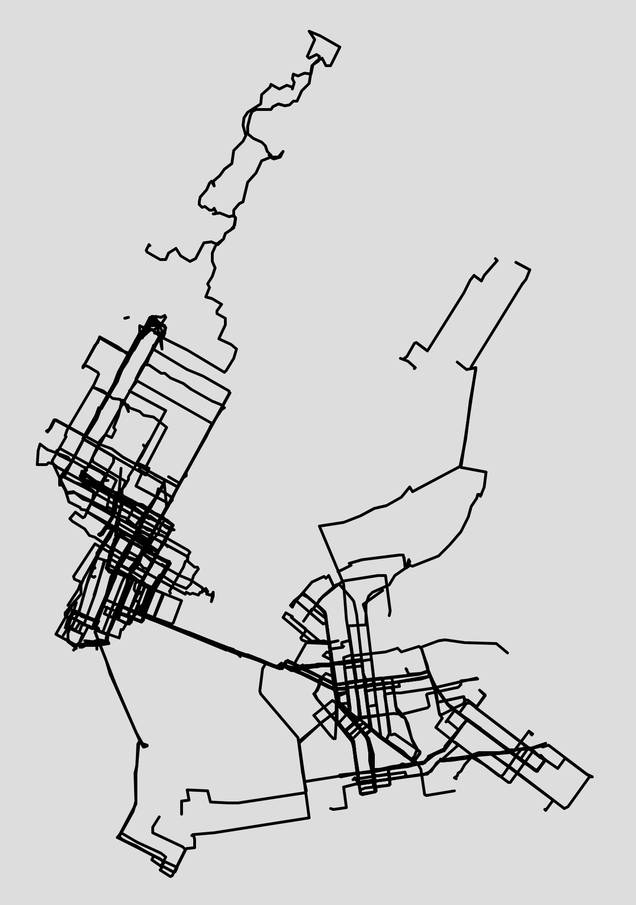

i also do some filtering of trajectories to produce this map, since gps outages can result in absurd junk positions with large displacement. in practice this was very simple: just reject points that jump unreasonably far, and throw out trajectories where more than a threshold rate of points fail this test.

**todo:** finish the client and update this article!
- cooler map; interactivity, filtering
- colormaps: length, cost, etc
